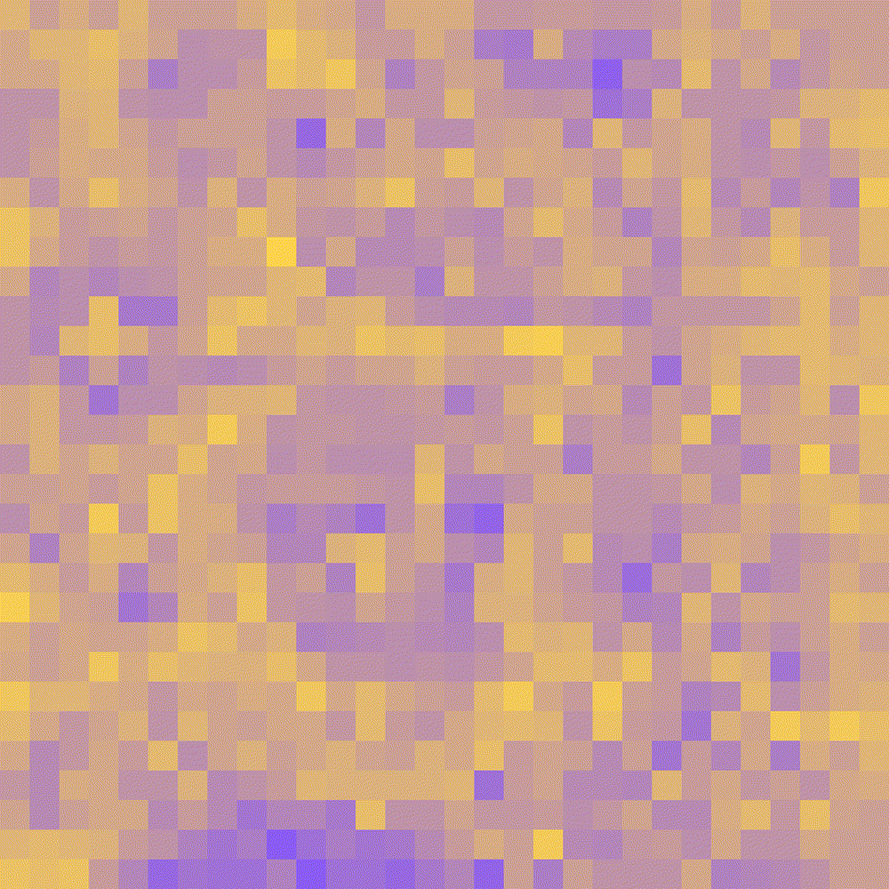

# Perceptron

🦾 Built a Perceptron from Scratch in C (the most basic unit of a neural network)

## What is this?

A Perceptron is the most fundamental building block of a neural network, proposed by Frank Rosenblatt in 1957.
It mimics how a biological neuron works: it receives multiple input signals, computes a weighted sum based on each input's "weight," and produces an output based on a decision rule.

## Evolution of the Weight Matrix

The image below shows how the weight matrix evolves throughout training (each frame corresponds to the weight matrix after one training pass):

<p align="center">
  
</p>

The weight matrix is visualized with a purple-to-yellow gradient:

- **Purple**: Low/negative weight values → these pixels **suppress** the output (push the model toward classifying as "rectangle")
- **Yellow**: High/positive weight values → these pixels **boost** the output (push the model toward classifying as "circle")

## Structure Diagram

```
Input Layer                           Weights            Sum & Decision    Output
                                          
[0.5][0.5][0.5][0.6][0.7][0.5]  ─── W1  ~ W6  ──┐
[0.5][0.6][0.7][0.8][0.7][0.5]  ─── W7  ~ W12 ──┤
[0.5][0.7][0.9][0.9][0.8][0.5]  ─── W13 ~ W18 ──┤
[0.5][0.8][0.9][0.9][0.9][0.6]  ─── W19 ~ W24 ──┼──────>  ( ? ) ──────> Circle?
[0.5][0.7][0.8][0.9][0.7][0.5]  ─── W25 ~ W30 ──┤
[0.5][0.6][0.7][0.7][0.6][0.5]  ─── W31 ~ W36 ──┤
[0.5][0.5][0.6][0.6][0.5][0.5]  ─── W37 ~ W42 ──┘
```

## Decision Formula

$$
\text{output} = \sum_{i=1}^{n} x_i \cdot w_i
$$

$$
\text{result} =
\begin{cases}
\text{Class A (e.g. this is a "circle")} & \text{if } \text{output} > \text{bias} \\
\text{Class B (e.g. this is a "rectangle")} & \text{otherwise}
\end{cases}
$$

Each input $x_i$ has a corresponding weight $w_i$, which determines how much influence that input has on the final result.

## Training Principle

Each training round:

- If a **rectangle** is misclassified as a "circle" → **subtract** its pixel values from the weight matrix
- If a **circle** is misclassified as a "rectangle" → **add** its pixel values to the weight matrix

By repeatedly "adding circles, subtracting rectangles," the weight matrix gradually accumulates the pixel pattern of circles while canceling out the pattern of rectangles. After many training rounds, the weight matrix naturally evolves into a "circle-sensitive" pattern.

## Training Results

```
[TRAIN - 0] Adjusted 192 times
...
[TRAIN - 44] Adjusted 21 times
[TRAIN - 45] Adjusted 30 times
[TRAIN - 46] Adjusted 22 times
[TRAIN - 47] Adjusted 8 times
[TRAIN - 48] Adjusted 0 times
[TRAIN - 49] Adjusted 0 times

The untrained model failed 200 times
The fail rate of untrained model is 0.500000
The trained model failed 175 times
The fail rate of trained model is 0.437500
Improvement after training: 12.50%
```

After training, the failure rate decreases, showing that the weight matrix has indeed learned some features of "circles."

The `Adjusted` count printed each round gradually converges toward zero.

However, the improvement is limited (only 12.5%), because a perceptron has only **one layer of weights** and can only learn a very simple linear decision rule.

## Summary

> A perceptron is essentially a bunch of weighted switches. The weights are continuously adjusted through "trial and error," eventually allowing the system to make correct judgments about its inputs. Stacking and connecting multiple perceptrons together forms a real neural network.

Perhaps this is the first step toward silicon-based life growing a brain?

## Acknowledgements

The code structure and implementation approach for this project are inspired by [tsoding/perceptron](https://github.com/tsoding/perceptron). Thanks to the original author for open-sourcing it.